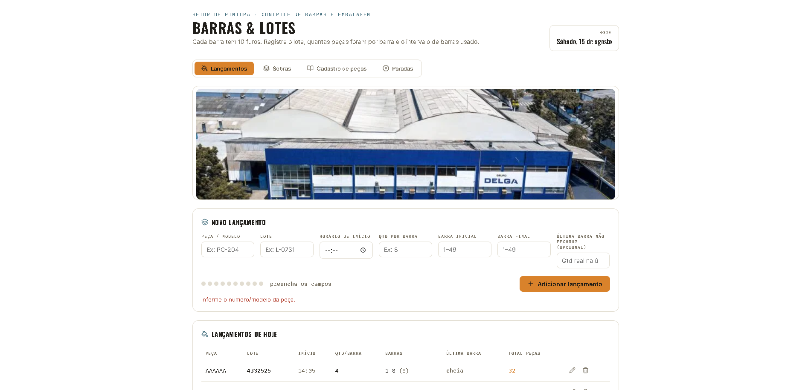
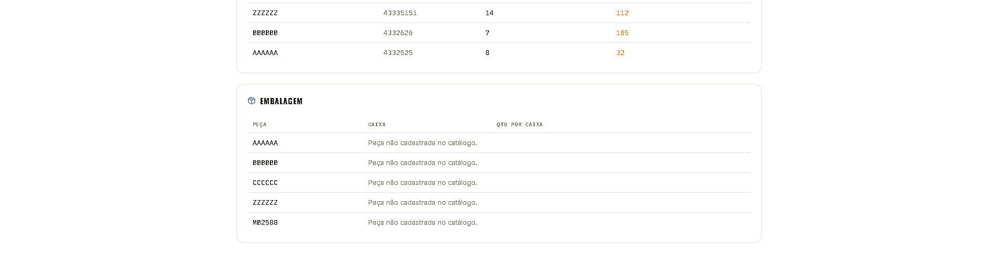
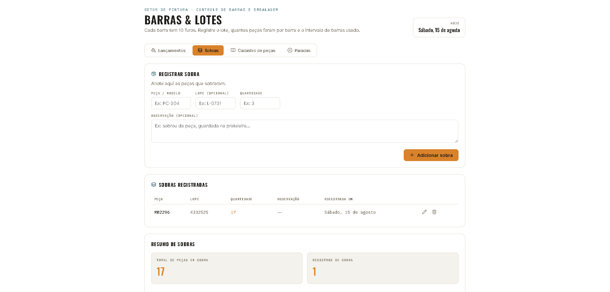
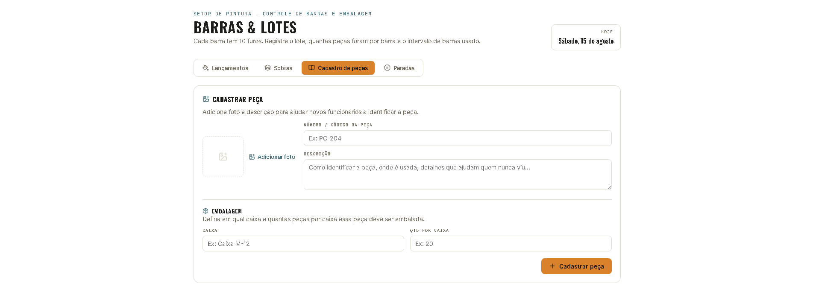
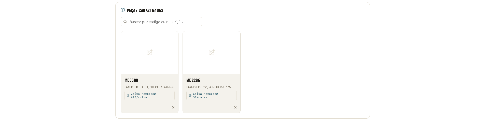
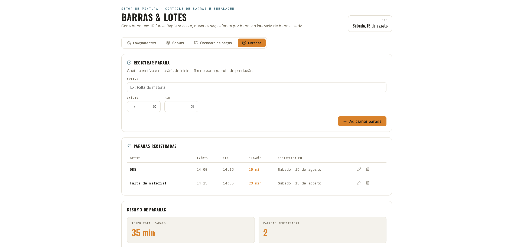

# Barras & Lotes — Setor de Pintura · Controle de Barras e Embalagem

Aplicativo interno do **Grupo Delga** para o setor de **pintura em pó**
registrar a produção do dia sem depender de planilha ou backend: cada
peça pintada passa por **barras** (o varal onde as peças ficam penduradas
para curar), e o operador só precisa anotar o lote, o horário e quantas
peças couberam em cada barra. O sistema calcula sozinho quantas barras
foram usadas, o total de peças, controla sobras, o catálogo de embalagem
de cada peça e as paradas de produção — tudo em uma única página, guardado
na memória do navegador.

## O que é o processo que o app controla

- Cada **barra** do túnel de pintura tem **10 furos**, onde as peças são
  penduradas.
- Existem **49 barras** no total, numeradas de 1 a 49, dispostas em
  **ciclo**: depois da barra 49 a contagem volta para a 1. Por isso um
  lançamento pode "começar na 48 e terminar na 5", por exemplo.
- Cada **lote** de peças ocupa um intervalo de barras. O operador informa
  a peça/modelo, o número do lote, o horário de início, quantas peças
  cabem por barra e o intervalo de barras (inicial → final) usado.
- Se a última barra do intervalo não fechou (sobrou furo vazio), o
  operador informa a quantidade real que coube nela em vez do padrão.

## Telas do sistema

### 1. Lançamentos

Aba principal, com a foto da unidade Grupo Delga no topo e o formulário
de novo lançamento (peça/modelo, lote, horário de início, quantidade por
barra, barra inicial/final e a opção de "última barra não fechou"):

<p align="center">
  
</p>

Cada lançamento adicionado aparece na tabela **"Lançamentos de hoje"**,
já com as barras usadas, se a última barra fechou ou não, e o total de
peças calculado automaticamente:

<p align="center">
  
</p>

No fim da aba, o **Resumo do dia** soma o total de peças, barras usadas e
modelos diferentes lançados, com o detalhamento por peça/lote e um botão
para **exportar tudo em Excel**. Logo abaixo, o painel de **Embalagem**
cruza cada peça lançada com o catálogo — e avisa quando uma peça ainda
não tem embalagem cadastrada:

<p align="center">
  
</p>

### 2. Sobras

Registro separado para peças que sobraram no dia sem virar um lançamento
de produção — informando peça, lote (opcional), quantidade e uma
observação livre. Fica com seu próprio resumo (total de peças em sobra e
quantidade de registros):

<p align="center">
  
</p>

### 3. Cadastro de peças

Catálogo com foto e descrição de cada peça — pensado para ajudar
funcionários novos a identificar o que estão pintando — e a regra de
embalagem dela (em qual caixa e quantas peças por caixa):

<p align="center">
  
</p>

As peças cadastradas ficam em uma grade com busca por código ou
descrição, mostrando a caixa e a quantidade por caixa em cada card:

<p align="center">
  
</p>

### 4. Paradas

Registro de paradas de produção (motivo, horário de início e fim), com a
duração calculada automaticamente e um resumo do tempo total parado no
dia:

<p align="center">
  
</p>

## Como rodar

```bash
npm install
npm run dev
```

Depois abra o endereço que aparecer no terminal (geralmente `http://localhost:5173`).

Para gerar a versão de produção:

```bash
npm run build
npm run preview
```

## Funcionalidades

- **Lançamentos**: registra peça, lote, horário de início, quantidade por
  barra e o intervalo de barras usado (1 até 49 — o ciclo reinicia
  sozinho assim que a embalagem retira as peças da barra). Calcula
  automaticamente quantas barras foram usadas e o total de peças,
  inclusive quando a última barra não fecha (quantidade parcial).
- **Sobras**: controle separado para peças que sobraram sem virar
  lançamento.
- **Cadastro de peças**: catálogo com foto, descrição e a embalagem de
  cada peça (em qual caixa e quantos por caixa ela deve ser embalada),
  com busca por código ou descrição.
- **Embalagem**: nas abas de Lançamentos e Sobras, um painel busca
  automaticamente no catálogo a caixa e a quantidade cadastradas para
  cada peça do dia — e avisa quando uma peça lançada ainda não tem
  embalagem cadastrada.
- **Paradas**: registra motivo, horário de início e fim de cada parada de
  produção; a duração é calculada automaticamente, com um resumo do
  tempo total parado no dia.
- **Exportar Excel**: no resumo do dia, um botão gera um `.xlsx` com duas
  abas — "Lançamentos de hoje" (linha a linha) e "Resumo do dia" (totais
  e soma por modelo) — pronto para baixar direto do navegador.

## Estrutura do projeto

```
public/
└── delga-fabrica.png             # imagem da unidade, usada no topo de Lançamentos

src/
├── main.jsx                      # ponto de entrada do React
├── App.jsx                       # componente raiz, controla a aba ativa
├── constants.js                  # constantes compartilhadas (furos e total de barras)
├── utils/
│   ├── date.js                   # formatação de data em pt-BR
│   ├── barras.js                 # sequência de barras usadas (ciclo 1–49)
│   ├── validarLancamento.js      # validação e cálculo de um lançamento
│   ├── paradas.js                # cálculo e formatação de duração das paradas
│   └── exportExcel.js            # geração do .xlsx (lançamentos + resumo do dia)
├── hooks/
│   ├── useLancamentos.js         # lógica de negócio dos lançamentos (validação, totais)
│   ├── useSobras.js              # lógica de negócio das sobras
│   ├── useCatalogoPecas.js       # cadastro/busca de peças + embalagem
│   └── useParadas.js             # cadastro e cálculo de duração das paradas
├── components/
│   ├── layout/
│   │   ├── Header.jsx            # título, "setor de pintura" e data do dia
│   │   └── Tabs.jsx              # navegação entre Lançamentos, Sobras, Cadastro e Paradas
│   ├── common/
│   │   ├── BarPegs.jsx           # bolinhas que representam os furos ocupados
│   │   ├── HeroBar.jsx           # imagem da unidade Grupo Delga no topo de Lançamentos
│   │   └── EmbalagemPanel.jsx    # painel de embalagem (consulta o catálogo por código)
│   ├── lancamentos/
│   │   ├── LancamentosTab.jsx        # orquestra a aba (usa useLancamentos)
│   │   ├── NovoLancamentoForm.jsx    # formulário de novo lançamento (com horário de início)
│   │   ├── LancamentosTable.jsx      # tabela dos lançamentos do dia
│   │   └── ResumoDia.jsx             # totais, soma por modelo e botão "Exportar Excel"
│   ├── sobras/
│   │   ├── SobrasTab.jsx             # orquestra a aba (usa useSobras)
│   │   ├── NovoSobraForm.jsx         # formulário de nova sobra
│   │   ├── SobrasTable.jsx           # tabela de sobras registradas
│   │   └── ResumoSobras.jsx          # totais de sobras
│   ├── catalogo/
│   │   ├── CatalogoTab.jsx           # orquestra a aba (usa useCatalogoPecas)
│   │   ├── CadastrarPecaForm.jsx     # formulário com upload de imagem + embalagem
│   │   ├── PecasGrid.jsx             # busca + grade de cards
│   │   └── PecaCard.jsx              # card individual de uma peça (com embalagem)
│   └── paradas/
│       ├── ParadasTab.jsx            # orquestra a aba (usa useParadas)
│       ├── NovoParadaForm.jsx        # formulário de nova parada
│       ├── ParadasTable.jsx          # tabela de paradas registradas
│       └── ResumoParadas.jsx         # tempo total parado e quantidade de registros
└── styles/
    ├── theme.css                 # variáveis de cor/tipografia + componentes de UI
    └── catalogo.css              # estilos específicos da aba de catálogo/embalagem
```

**Regra geral:** cada componente só cuida de UI; a lógica (validação,
cálculo, estado) fica nos hooks em `src/hooks`. Isso facilita testar e
reaproveitar sem precisar mexer no visual.

## Sobre os dados

Os dados (lançamentos, sobras, peças cadastradas e paradas) ficam apenas
na memória do navegador — ao recarregar a página, tudo é perdido. Para
persistir entre sessões, o próximo passo é conectar os hooks
(`useLancamentos`, `useSobras`, `useCatalogoPecas` e `useParadas`) a uma
API/banco de dados, sem precisar alterar os componentes visuais.

## Tecnologias

- React 18 + Vite
- lucide-react (ícones)
- xlsx / SheetJS (exportação do resumo do dia para Excel)
